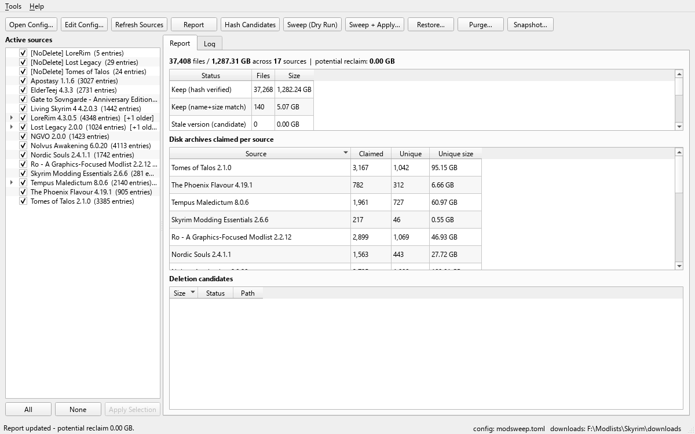
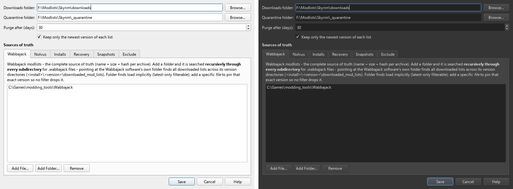

# Mod Sweep GUI tour

The GUI is a thin front-end over the same pipeline as the CLI: it reads
the same `modsweep.toml`, resolves sources with the same announcements,
and renders the same report data. Anything the GUI writes (excludes,
pins), the CLI honors, and vice versa.

```powershell
uv sync --extra gui          # from source; installs PySide6
uv run modsweep-gui          # optional: pass a config path
```

Installed via the standalone zip, just run `modsweep-gui.exe`; via
uv/pipx, install with the extra: `uv tool install "modsweep[gui]"`.

No custom palette or stylesheet is set anywhere, so the interface follows
the system light/dark theme natively.



## First run

A welcome dialog walks through the typical flow (suppressible; the choice
persists). Every button carries a hover tooltip, so the interface is
self-describing:

1. **Report** - classify the downloads directory (read-only)
2. **Hash Candidates** - verify candidates by hash (the safety gate)
3. **Sweep (Dry Run)** - preview exactly what would be quarantined
4. **Sweep + Apply** - move candidates to a restorable quarantine batch

If there is no config yet, **Edit Config...** builds one from scratch (see
below) - a new user never needs to touch TOML.

## The sources pane

Every resolvable source appears in a checkable tree on the left:

- **Checked** = active or pinned: its files are protected.
- **Unchecked with a ban icon** = excluded (retired). Tick it to
  reinstate - Apply Selection removes the exclude for you. Sources caught
  by a broader glob pattern are locked instead, with a tooltip pointing
  at Edit Config > Exclude.
- **Unchecked with a padlock, italic** = superseded: `latest_only` is
  keeping a newer version. The inline suffix says so; right-click to pin
  this version if you want it back.
- **Pin icon** = explicitly named in the config; the latest-only filter
  never drops it.

Lists group alphabetically with the newest version as the row and older
versions nested beneath (`[+N older]`), collapsed unless a child carries a
pin or exclusion - so a growing manifest bundle stays one row per list
while every version remains one expander away. Nothing active is ever
hidden.

Untick lists to retire them (All/None for bulk), then **Apply Selection**
writes exact-label excludes to the config. Right-clicking a source offers
the moves its state allows: pin a version (superseded to rescue it, or
active to protect it from future filters), unpin, retire or reinstate,
and open the manifest's location in the file manager.

## The Report tab

Sortable tables, refreshed automatically after any state-changing action:

- **Status summary** - files and bytes per classification, plus the
  potential-reclaim headline.
- **Claims per source** - how many disk archives each source claims, and
  the `unique` column: files claimed by no other source, i.e. what
  retiring that source would free.
- **Deletion candidates** - every stale/unclaimed file, largest first.
  Hover a status for what it means. Right-click a row to open it in the
  file manager, quarantine just that file, or delete it (confirmation, no
  undo). Single-file actions reuse the normal batch machinery, so they
  remain restorable and purgeable like any sweep.

## The Log tab

Source-resolution announcements (exclusions, supersessions, duplicate
warnings), pipeline timings, and action output stream here live as
workers run. Action results also land in the status bar and pop up as
dialogs, so outcomes are unmissable even when there was nothing to do.

## The config editor



**Edit Config...** opens a full editor: downloads and quarantine folder
pickers, the purge trust period, the latest-only toggle, one tab per
source kind (Wabbajack / Nolvus / Installs / Recovery / Snapshots) with
add-file/add-folder buttons and an explanation of what each kind means,
and the exclude list. The Nolvus tab offers the `bundled` keyword - the
manifests shipped with the app plus in-app updates. Saving rewrites
`modsweep.toml` (comments are regenerated) and reloads the sources. The
Help button explains source resolution and retirement.

## Quarantine: Restore and Purge

- **Restore...** lists batches (newest preselected) and moves one back to
  its original locations. Occupied paths are skipped and reported; a
  fully restored batch cleans up after itself.
- **Purge...** permanently deletes the batch you pick - the only
  unrecoverable action in Mod Sweep, behind a strongly-worded
  confirmation that defaults to No. Note the semantics split: the
  `keep_days` trust period governs only the CLI's age-based purge; this
  button purges whatever you pick, and the confirmation calls out batches
  still younger than the trust period.

## Updates

- **Tools > Update Nolvus Manifests...** fetches newly published bundled
  manifests from the project repository into your per-user data dir; the
  `bundled` source picks them up immediately.
- **Help > Check for Updates...** compares your version against the
  latest GitHub release and offers to open the releases page. The app
  never replaces its own executable.

## Threading

All actions run on a worker thread with a progress bar (indeterminate
until an action reports real progress, e.g. per-file hashing), so the
window never looks frozen. One action runs at a time; buttons re-enable
when it finishes or fails, and failures land in the status bar and Log.
